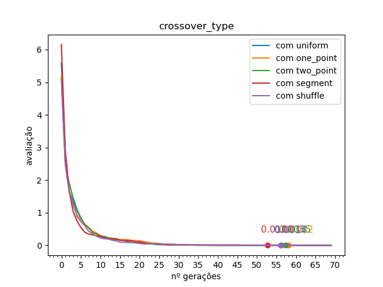
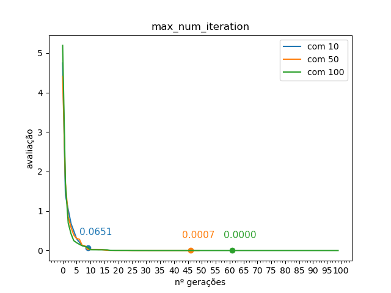
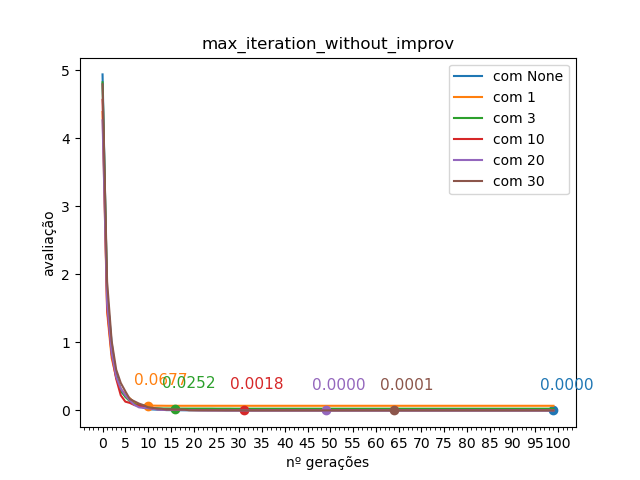

# Introdução

O seguinte método foi usado para realizar a escolha dos hiperparâmetros:

1. tem-se de um conjunto inicial de hiperparâmetros (inicialmente os que estavam no código fornecido)
2. avalia-se cada parâmetro individualmente num certo espaço de possibidades (uma sequência de valores para os valores numéricos, e uma tupla com todas as possibilidades para os categóricos), guardando o melhor valor
3. cria-se um novo conjunto com esses novos parâmetros
4. repete-se o processo, restringindo ou alargando os intervalos conforme necessário

(para-se quando não se percebe mais muita mudança)

## Código

Foram usados 10 experimentos para cada teste, com exceções (às vezes 2, 3 ou 4 vezes mais).

Muito foi feito no código para tornar o trabalho uma tarefa (aproximadamente) fácil. Mais pode ser lido no repositório do github:  
<https://github.com/theo-al/hiper_ag>

É possível compilar esse relatório a partir de lá com `pandoc relatorio.md -o relatorio.out.pdf`.

\pagebreak

# Iteração 1

| nome                         | valor       |
|:----------------------       |:-----------:|
| elit ratio                   | .10         |
| mutation probability         | .001        |
| crossover probability        | .60         |
| parents portion              | .10         |
| crossover type               | one point   |
| mutation type                | uniform by center |
| selection type               | roulette    |
| max num iteration            | 20          |
| population size              | 100         |
| max iteration without improv | None        |

## Gráficos

{width=50%}
{width=50%}

{width=50%}
{width=50%}

{width=50%}
{width=50%}

{width=50%}
{width=50%}

{width=50%}
{width=50%}

\pagebreak

## Resultados

- crossover probability (.01, .23, .46, .68, .90):  
     .23 desceu mais rápido no começo mas foi estabilizando,
     .90 foi um pouco mais devagar no começo mas terminou mais baixo  
     = .90
- crossover type:  
     uniform desceu mais rápido no começo mas foi estabilizando,
     shuffle foi um pouco mais devagar no começo mas terminou mais baixo  
     = uniform
- elit ratio (de .00 a .09, passo .01):  
    os mais próximos de .09 foram melhor  
    = 0.09
- mutation probability (.01, .18, .35, .53, .70):  
    é difícil de ver exatamente quem termina com o menor valor, mas .35 desce mais rápido e .53 parece o mais baixo  
    = 0.35
- mutation type:  
    gauss by x desceu mais rápido no começo mas foi estabilizando,
    uniform by center foi um pouco mais devagar no começo mas terminou mais baixo  
    = gauss by x ou **uniform by center**
- parents portion (.23, .46, .68, .90):  
    .23 e .46 são os valores que descem mais rápido e chegam mais baixo, mas .46 ganha  
    = 0.46
- selection type:  
    sigma scaling desceu mais rápido no começo mas foi estabilizando
    tournament foi um pouco mais devagar no começo mas terminou mais baixo  
    = tournament

- max num iteration:  
    vai melhorando com mais iterações, mas a diferença é pouca a partir de 69
- population size:  
    vai melhorando com população maior, mas a diferença é pouca a partir de 70

\pagebreak

# Iteração 2

| nome                         | valor       |
|:----------------------       |:-----------:|
| elit ratio                   | .09         |
| mutation probability         | .35         |
| crossover probability        | .90         |
| parents portion              | .46         |
| crossover type               | uniform     |
| mutation type                | uniform by center |
| selection type               | tournament  |
| max num iteration            | [70]        |
| population size              | [100]       |
| max iteration without improv | None        |

## Gráficos

{width=50%}
{width=50%}

{width=50%}
{width=50%}

{width=50%}
{width=50%}

{width=50%}
{width=50%}

{width=50%}
{width=50%}

\pagebreak

## Resultados

- crossover probability:  
    0.46 foi o que, depois de algumas vezes tentando, consistentemente descia mais rápido  
    = .46
- crossover type:  
    é o que desceu e estabilizou mais rápido
    = segment
- elit ratio:  
    .09 foi o que mais consistentemente desceu e estabilizou
    = .09 ou .08
- mutation probability:  
    continuou em .35  
    = .34
- mutation type:  
    foi o mais baixo e mais rápido
    = gauss by x
- parents portion:  
    .23 teve o valor mais baixo e estabilizou antes
    = .23
- selection type:  
    = tournament
- max iteration without improv:  
    = 20
    arbitrado em 23

\pagebreak

# Iteração 3

| nome                         | valor       |
|:----------------------       |:-----------:|
| elit ratio                   | .09         |
| mutation probability         | .34         |
| crossover probability        | .46         |
| parents portion              | .23         |
| crossover type               | segment     |
| mutation type                | gauss by x  |
| selection type               | tournament  |
| max num iteration            | [70]        |
| population size              | [100]       |
| max iteration without improv | 23          |

## Gráficos

{width=50%}
{width=50%}

{width=50%}
{width=50%}

{width=50%}
{width=50%}

{width=50%}
{width=50%}

{width=50%}
{width=50%}

\pagebreak

## Resultados

- crossover probability (.24, .31, .39, .46, .53, .61, .68, .75, .83, .90):  
    .75 deu igual ao .46, .46 foi mantido  
    = igual
- crossover type:
    shuffle foi o melhor, com segment em segundo  
    = shuffle
- elit ratio (.06, .07, .09, .10, .11, .13, .14):  
    0.10 demorou mais para estabilizar, mas desceu mais rápido  
    para não desviar muito de .09, escolhi o .10
    = .10
- mutation probability (.25, .27, .29, .31, .34, .36, .38, .40):  
    .40 estabilizou mais rápido
    = .40
- mutation type:
    gauss by center estabilizou levemente mais rápido que gauss by x, gauss by x mantido  
    = igual
- parents portion (.20, .24, .29, .33, .37, .41, .46, .50):  
    o melhor foi .24, .23 mantido  
    = igual
- selection type:  
    linear ranking é o primeiro que estabiliza e o que desce mais rápido  
    = linear ranking

\pagebreak

# Iteração Final

| nome                         | valor       |
|:----------------------       |:-----------:|
| elit ratio                   | .10         |
| mutation probability         | .40         |
| crossover probability        | .46         |
| parents portion              | .23         |
| crossover type               | shuffle     |
| mutation type                | gauss by x  |
| selection type               | linear ranking  |
| max num iteration            | 100         |
| population size              | [80]        |
| max iteration without improv | 25          |

## Gráficos

{width=50%}
{width=50%}

{width=50%}
{width=50%}

{width=50%}
{width=50%}

{width=50%}
{width=50%}

{width=50%}
{width=50%}

\pagebreak

## Resultados

- crossover type:  
    = segment (final)
- mutation probability (.33, .34, .35, .44, .45):  
    todos são bem parecidos, mas o .44 desce mais rápido  
    =.44
- elit ratio:  
    .11 foi levemente melhor, .10 mantido  
    =.10
- selection type:  
    fully random ficou empatado com linear ranking  
    eu acho que quando todos os (x,y) são muito próximos de zero, só de misturar os genes já vai aproximando do resultado  
    = linear ranking (final)

\pagebreak

# Parâmetros Finais

| nome                         | valor       |
|:----------------------       |:-----------:|
| elit ratio                   | .10         |
| mutation probability         | .44         |
| crossover probability        | .46         |
| parents portion              | .23         |
| crossover type               | segment        |
| mutation type                | gauss by x     |
| selection type               | linear ranking |
| max num iteration            | 50          |
| population size              | 160         |
| max iteration without improv | 25 / None   |

{width=50%}
{width=50%}

{width=50%}

\pagebreak

## Outros gráficos
{width=50%}
{width=50%}

{width=50%}
{width=50%}

{width=50%}
{width=50%}

{width=50%}

## Detalhes sobre alguns parâmetros

- max iteration without improv:  
    usei basicamente como uma forma de perceber quando as versões do gráfico se estabilizavam.
- population size:  
    como notado antes, vai melhorando com população maior: aproxima o zero mais rápido conforme tem mais indivíduos numa geração, mas também faz o algoritmo demorar mais tempo para rodar.
- max num iteration:  
    como notado antes, vai melhorando com mais iterações, mas a diferença vai diminuindo a partir de 69. com o parâmetro max iteration without improv não-nulo, deixa de fazer diferença a partir de mais ou menos 50 gerações.

## Considerações finais

Nos últimos gráficos, é possível perceber que o sistema se aproxima de 0 muito rapidamente (cerca de 6 gerações), mas para chegar em 0.0001 demora mais umas 30, e alterando os parâmetros individualmente não se percebe uma diferença significativa. Se se quer realmente atingir a solução ótima, precisa-se de cerca de 60 gerações no total.

